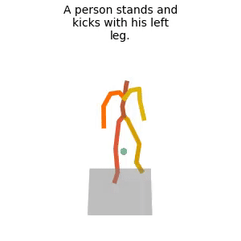

# OmniControl: Control Any Joint at Any Time for Human Motion Generation
### [Project Page](https://neu-vi.github.io/omnicontrol/) | [Paper](https://arxiv.org/abs/2310.08580)

> OmniControl: Control Any Joint at Any Time for Human Motion Generation  
> [Yiming Xie](https://ymingxie.github.io), [Varun Jampani](https://varunjampani.github.io/), Lei Zhong, [Deqing Sun](https://deqings.github.io/), [Huaizu Jiang](https://jianghz.me/)    


## Citation

```bibtex
@inproceedings{
xie2024omnicontrol,
title={OmniControl: Control Any Joint at Any Time for Human Motion Generation},
author={Yiming Xie and Varun Jampani and Lei Zhong and Deqing Sun and Huaizu Jiang},
booktitle={The Twelfth International Conference on Learning Representations},
year={2024},
url={https://openreview.net/forum?id=gd0lAEtWso}
}
```

## News
📢 **10/Dec/23** - First release

## TODO List
- [x] Code for training and inference.
- [x] Pretrained model on HumanML3D.
- [x] Evaluation code and metrics.
- [ ] Pretrained model with different training strategies.
- [ ] Evaluation for cross combination of joints.
- [ ] Pretrained model on KIT-ML.
<!-- - [ ] Interactive demo. -->

## Getting started

This code requires:

* Python 3.7
* conda3 or miniconda3
* CUDA capable GPU (one is enough)

### 1. Setup environment

Install ffmpeg (if not already installed):

```shell
sudo apt update
sudo apt install ffmpeg
```
For windows use [this](https://www.geeksforgeeks.org/how-to-install-ffmpeg-on-windows/) instead.

Setup conda env:
```shell
conda env create -f environment.yml
conda activate omnicontrol
python -m spacy download en_core_web_sm
pip install git+https://github.com/openai/CLIP.git
```

Download dependencies:

```bash
bash prepare/download_smpl_files.sh
bash prepare/download_glove.sh
bash prepare/download_t2m_evaluators.sh
```


### 2. Get data

#### Full data (text + motion capture)

**HumanML3D** - Follow the instructions in [HumanML3D](https://github.com/EricGuo5513/HumanML3D.git),
then copy the result dataset to our repository:

```shell
cp -r ../HumanML3D/HumanML3D ./dataset/HumanML3D
```

**KIT** - Download from [HumanML3D](https://github.com/EricGuo5513/HumanML3D.git) (no processing needed this time) and the place result in `./dataset/KIT-ML`


### 3. Download the pretrained models

Download the model(s) you wish to use, then unzip and place them in `./save/`. 

**HumanML3D**

[model_humanml](https://drive.google.com/file/d/1oTkBtArc3xjqkYD6Id7LksrTOn3e1Zud/view?usp=sharing)

```shell
cd save
gdown --id 1oTkBtArc3xjqkYD6Id7LksrTOn3e1Zud
unzip omnicontrol_ckpt.zip -d .
cd ..
```


## Motion Synthesis

### Generate with the manually defined spatial control signals and texts
Check the manually defined spatial control signals in [text_control_example](./utils/text_control_example.py#L650). You can define your own inputs following this file.
```shell
python -m sample.generate --model_path ./save/omnicontrol_ckpt/model_humanml3d.pt --num_repetitions 1
```

### Generate with the spatial control signals and text sampled from the HumanML3D dataset
We randomly sample spatial control signals from the ground-truth motions of HumanML3D dataset.
```shell
python -m sample.generate --model_path ./save/omnicontrol_ckpt/model_humanml3d.pt --num_repetitions 1 --text_prompt ''
```

**You may also define:**
* `--device` id.
* `--seed` to sample different prompts.
* `--motion_length` (text-to-motion only) in seconds (maximum is 9.8[sec]).

**Running those will get you:**

* `results.npy` file with text prompts and xyz positions of the generated animation
* `sample##_rep##.mp4` - a stick figure animation for each generated motion.

It will look something like this:



You can stop here, or render the SMPL mesh using the following script.

### Render SMPL mesh
This part is directly borrowed from [MDM](https://github.com/GuyTevet/motion-diffusion-model/tree/main#render-smpl-mesh).  
To create SMPL mesh per frame run:

```shell
python -m visualize.render_mesh --input_path /path/to/mp4/stick/figure/file
```

**This script outputs:**
* `sample##_rep##_smpl_params.npy` - SMPL parameters (thetas, root translations, vertices and faces)
* `sample##_rep##_obj` - Mesh per frame in `.obj` format.

**Notes:**
* The `.obj` can be integrated into Blender/Maya/3DS-MAX and rendered using them.
* This script is running [SMPLify](https://smplify.is.tue.mpg.de/) and needs GPU as well (can be specified with the `--device` flag).
* **Important** - Do not change the original `.mp4` path before running the script.

**Notes for 3d makers:**
* You have two ways to animate the sequence:
  1. Use the [SMPL add-on](https://smpl.is.tue.mpg.de/index.html) and the theta parameters saved to `sample##_rep##_smpl_params.npy` (we always use beta=0 and the gender-neutral model).
  1. A more straightforward way is using the mesh data itself. All meshes have the same topology (SMPL), so you just need to keyframe vertex locations. 
     Since the OBJs are not preserving vertices order, we also save this data to the `sample##_rep##_smpl_params.npy` file for your convenience.


## Train your own OmniControl


**HumanML3D**  
Download the [pretrained MDM model](https://drive.google.com/file/d/1XS_kp1JszAxgZBq9SL8Y5JscVVqJ2c7H/view?usp=sharing). The model is from [MDM](https://github.com/GuyTevet/motion-diffusion-model#3-download-the-pretrained-models).
Then place it in `./save/`.
Or you can download the pretrained model via
```shell
cd save
gdown --id 1XS_kp1JszAxgZBq9SL8Y5JscVVqJ2c7H
cd ..
```
You can train your own model via
```shell
python -m train.train_mdm --save_dir save/my_omnicontrol --dataset humanml --num_steps 400000 --batch_size 64 --resume_checkpoint ./save/model000475000.pt --lr 1e-5
```

## Evaluate

**HumanML3D**
* Takes about 45 hours (on a single GPU). You can take multi-GPUs to evaluate each setting in parallel to accelerate this process.
* The output of this script for the pre-trained models is provided in the checkpoints file.
```shell
./eval_omnicontrol_all.sh ./save/omnicontrol_ckpt/model_humanml3d.pt 
```
Or you can evaluate each setting separately, e.g., root joint (0) with dense spatial control signal (100).  
It takes about 1.5 hours.
```shell
./eval_omnicontrol.sh ./save/omnicontrol_ckpt/model_humanml3d.pt 0 100
```


## Code pointer to the main module of OmniControl
[Spatial Guidance](./diffusion/gaussian_diffusion.py#L450). (./diffusion/gaussian_diffusion.py#L450)  
[Realism Guidance](./model/cmdm.py#L158). (./model/cmdm.py#L158)

## Acknowledgments

Our code is based on [MDM](https://github.com/GuyTevet/motion-diffusion-model).  
The motion visualization is based on [MLD](https://github.com/ChenFengYe/motion-latent-diffusion) and [TMOS](https://github.com/Mathux/TEMOS). 
We also thank the following works:
[guided-diffusion](https://github.com/openai/guided-diffusion), [MotionCLIP](https://github.com/GuyTevet/MotionCLIP), [text-to-motion](https://github.com/EricGuo5513/text-to-motion), [actor](https://github.com/Mathux/ACTOR), [joints2smpl](https://github.com/wangsen1312/joints2smpl), [MoDi](https://github.com/sigal-raab/MoDi).

## License
This code is distributed under an [MIT LICENSE](LICENSE).  
Note that our code depends on other libraries, including CLIP, SMPL, SMPL-X, PyTorch3D, and uses datasets that each have their own respective licenses that must also be followed.
